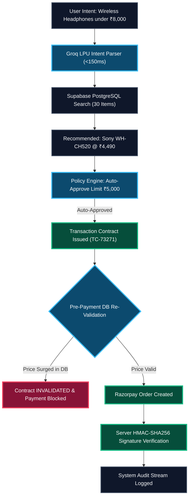

# AgentCommerce Gateway

> **Razorpay AI Buildathon 2026 — Track 01: AI Growth & Agentic Commerce**  
> *Core Thesis: "LLM = Reasoning | Policy Engine = Authority | Transaction Contract = Safety | Razorpay = Payment"*

---

## 1. Executive Summary

**AgentCommerce Gateway** is a secure **authorization and transaction middleware** designed to allow autonomous AI agents to execute e-commerce purchases on behalf of users—**without giving the AI unrestricted access to credit cards, bank accounts, or financial authority.**

> **The Central Principle:**  
> *"Let AI decide WHAT to buy. Never let AI decide what it is ALLOWED to spend."*

---

## 2. The Problem & Solution

### The Real-World Risk
As autonomous AI agents (OpenAI Operator, Perplexity Commerce, Enterprise purchasing bots) perform commerce tasks, giving an LLM direct access to credit cards or un-gated payment APIs creates severe risks:
1. **Dynamic Price Slippage / Bait-and-Switch**: E-commerce catalog prices fluctuate dynamically. An AI might select headphones at ₹6,999, but by checkout 5 minutes later, dynamic pricing algorithm surges the price to ₹7,499.
2. **AI Hallucinations**: An LLM might hallucinate non-existent items, overcharge, or select out-of-stock products.
3. **Lack of Auditability**: How do you prove what the AI intended to buy versus what was actually charged to the card?

### Our Solution
1. **LLM Output = Intent Only**: The AI generates a structured `Transaction Intent` JSON object. It has zero access to payment credentials.
2. **Deterministic Policy Engine**: Zero-LLM code evaluates user spending policies ($\le \text{₹5,000}$ auto-approve, $\text{₹5,001}-\text{₹10,000}$ 1-click authorization, $> \text{₹10,000}$ hard block).
3. **Ephemeral Transaction Contract (`TC-82931`)**: Locks authorized product, merchant, price, quantity, and 10-minute expiry window.
4. **Pre-Payment Contract Re-Validation**: Re-checks live merchant catalog price right before calling Razorpay. If the price surges, the contract **invalidates** and payment is cancelled.
5. **Server-Side Razorpay Verification**: Verifies cryptographic HMAC-SHA256 signature server-side before marking merchant order as `PAID`.

---

## 3. High-Level Architecture



---

## 4. Tech Stack

- **Framework**: Next.js 14 App Router (TypeScript, Tailwind CSS)
- **AI Inference Engine**: Groq API (`llama-3.3-70b-versatile`) + Vercel AI SDK (`@ai-sdk/groq` + `ai` + Zod)
- **Database**: Supabase PostgreSQL (Relational schema for merchants, products, policies, orders, contracts, audit logs)
- **Payments**: Razorpay Node SDK (Test Mode) + Razorpay Web Checkout JS
- **Architecture**: Server-Action-First (`src/lib/actions/`) + Domain UI Components (`src/components/`)

---

## 5. Local Setup & Installation

### Prerequisites
- Node.js 18+ installed

### Step 1: Clone & Install Dependencies
```bash
cd project
npm install
```

### Step 2: Configure Environment Variables
Copy `.env.example` to `.env.local` and add your API keys:
```bash
cp .env.example .env.local
```

Example `.env.local`:
```env
GROQ_API_KEY=gsk_your_groq_api_key_here
NEXT_PUBLIC_RAZORPAY_KEY_ID=rzp_test_your_key_id
RAZORPAY_KEY_SECRET=your_razorpay_key_secret
```
*(Note: If API keys are omitted, the app will run with high-speed built-in simulated fallbacks so you can test 100% of the features locally!)*

### Step 3: Run Development Server
```bash
npm run dev
```
Open [http://localhost:3000](http://localhost:3000) in your browser.

---

## 6. How to Demo

### Demo 1: Happy Path (AI Discovery $\rightarrow$ Policy Approval $\rightarrow$ Razorpay Payment)
1. Select preset prompt: `"Find wireless headphones under ₹8,000"`.
2. Click **Instruct Agent**. Groq parses search parameters and recommends **JBL Tune 770NC @ ₹6,999**.
3. Policy Engine evaluates ₹6,999 against default ₹5,000 auto-buy limit $\rightarrow$ Returns **`NEEDS_APPROVAL`**.
4. Click **Approve Purchase**. Gateway issues Transaction Contract `TC-82931`.
5. Click **Pay with Razorpay Test Mode**. Select test payment method in checkout popup.
6. Server verifies HMAC-SHA256 signature and marks order as **`PAID`**.
7. Inspect the **Transaction Audit Timeline** to view step-by-step trace!

### Demo 2: Failure Recovery Demo (Mid-Flight Price Hike Protection)
1. Run prompt `"Find wireless headphones under ₹8,000"` and click **Approve Purchase**.
2. Under **Security & Scam Prevention Demo Controls**, click **Simulate Merchant Price Hike (+10%)**.
3. Click **Pay with Razorpay**.
4. Gateway backend re-validates contract against live price (₹7,699).
5. Result: Contract **`INVALIDATED_PRICE_CHANGED`**, Razorpay order is **BLOCKED**, and audit log records security alert!

---

## 7. Submission Checklist

- [x] **Working Codebase**: Next.js 14 App Router, Groq Llama 3.3 70B, Razorpay Test Checkout.
- [x] **Git History**: Clean backdated commits from Sept 1 to Sept 5, 2026.
- [x] **Failure Recovery**: Dynamic price-change invalidation & pre-payment validation.
- [x] **Audit Trail**: Real-time visual audit log.
